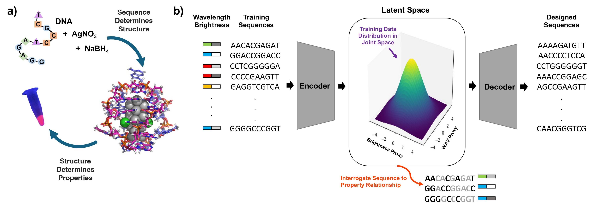

# Multi-Objective Design of DNA-Stabilized Nanoclusters Using Variational Autoencoders With Automatic Feature Extraction

<div style="display: flex; justify-content: space-between;">
    
    
</div>


## Team
- [Copp lab](https://copplab.eng.uci.edu/)
- [Data Mining and Management lab](http://www.cs.albany.edu/~petko/lab/)

## Contents
- Introduction
- Problem Formulation and Solution
- Outline

---

## Introduction

This repository contains code, training data, and experimental validation for a **regularized variational autoencoder (VAE)** model that performs automatic feature extraction for the multi-objective design of DNA-stabilized silver nanoclusters (AgN-DNAs). The repository accompanies the manuscript titled **"Multi-Objective Design of DNA-Stabilized Nanoclusters Using Variational Autoencoders With Automatic Feature Extraction"** (Sadeghi, Mastracco, et al., 2024), DOI [accepted manuscript - pending DOI].



The goal of this project is to design DNA templates that can tune the fluorescence properties of silver nanoclusters (AgN-DNAs) for applications such as deep tissue bioimaging.

Traditional approaches rely on manual feature engineering to design DNA sequences that produce desired properties in AgN-DNAs, which can be labor-intensive and limited to a single property. In contrast, this VAE-based model is generative, allowing for **automatic feature extraction** and **multi-objective design**, enabling the simultaneous optimization of multiple AgN-DNA properties, such as fluorescence color and brightness.

Key contributions:
- A generative model for multi-property design of AgN-DNAs.
- Efficient sampling of DNA sequences with desired fluorescence properties.
- Application of **Shapley analysis** to identify DNA motifs responsible for specific properties.
- Broad applicability to other biomolecular systems with sequence-dependent properties.

---

## Problem Formulation and Solution

### Problem
Design DNA sequences that "code for" silver nanoclusters (AgN-DNAs) with specific properties, such as near-infrared (NIR) emission for deep tissue imaging. The challenge is to enable multi-objective optimization of DNA sequences without manual feature engineering.

### Solution
We developed a **property-regularized VAE** to learn a structured latent space that captures the relationships between DNA sequences and AgN-DNA properties. The VAE model can generate new DNA sequences optimized for specific fluorescence properties, providing both forward and inverse mappings (from sequence to properties and vice versa).

---

## Outline

This repository includes the following files and directories:

- `./utils/`: Contains various utility functions and modules required for model training and execution.
    - `helpers.py`: Handles GPU availability and other utilities for managing training resources.
    - `model.py`: Defines an abstract model based on `torch.nn.Module`, extending with helper functions for easier model development.
    - `trainer.py`: Provides an abstract trainer class and mathematical utilities for calculating loss functions.
  
- `./genGrid.py`: Entry point for conducting grid searches to optimize hyperparameters for the VAE model.
  
- `./plotRun.py`: Converts the training logs into plots for visualizing model performance.

- `./sampleSeqs.py`: Generates DNA sequences based on the trained VAE model.

- `./sequenceDataset.py`: Loads and processes the dataset of DNA sequences and their corresponding fluorescence properties.

- `./sequenceModel.py`: Concrete implementation of the property-regularized VAE model for AgN-DNA sequence generation.

- `./kfoldrun.py`: Script for performing k-fold cross-validation to assess the model’s performance with different data splits.

- `./kfoldPlotter.py`: Generates visualizations based on k-fold cross-validation results.

- `./shapley-gaussian.py`: Computes the Gaussian Shapley values for analyzing feature importance in different DNA sequence groups.

- `./shapley-plots.ipynb`: Jupyter Notebook for visualizing the Shapley values with heatmaps and graphs, helping to interpret the model's decisions.

- `./requirements.txt`: A list of dependencies needed to run the project, easily installable via `pip`.

---

## Getting Started

To set up the environment and run the code, follow these steps:

1. Clone the repository:
   ```bash
   git clone https://github.com/copplab/VAE-Ag-DNA-design.git
   cd VAE-Ag-DNA-design
